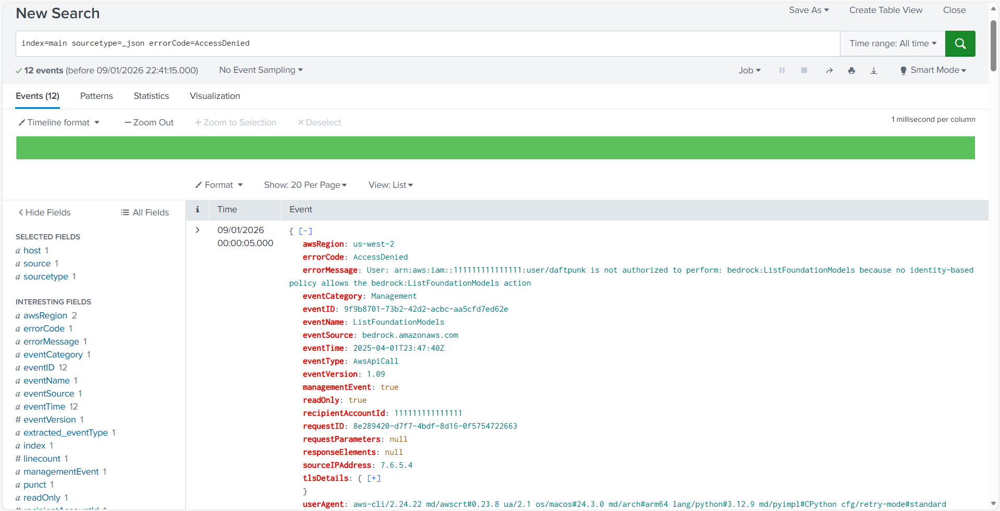

# Unauthorized AWS API Calls (AccessDenied)

# Splunk Failed Login Analysis

## Objective
Detect and analyze failed authentication attempts using Splunk,
simulating a SOC analyst investigation based on AWS CloudTrail logs.

## Dataset
AWS CloudTrail logs in JSON format were ingested into Splunk.
Most events were indexed into the default `main` index, which contains
over 2.4 million events.

## Tools Used
- Splunk Enterprise (Free Trial)
- AWS CloudTrail sample logs
- GitHub (documentation and version control)

## Detection Logic
Failed authentication attempts were identified by filtering
CloudTrail events with the error code `AccessDenied`.

## Evidence

## Alerting
A scheduled Splunk alert was configured to detect repeated AWS API authentication
failures. The alert triggers when multiple AccessDenied events are observed from
the same source IP or user within a defined time window.

Detailed alert logic and configuration can be found in the project documentation.

## Findings
- Multiple AccessDenied events detected
- Requests originated from specific IP addresses
- Events related to AWS API calls without sufficient permissions

## MITRE ATT&CK Mapping
The detected activity was mapped to relevant MITRE ATT&CK techniques,
including Valid Accounts (T1078) and Account Discovery (T1087).

## Conclusion
This project demonstrates basic SOC detection skills using Splunk,
including log ingestion, query development, and security analysis.
